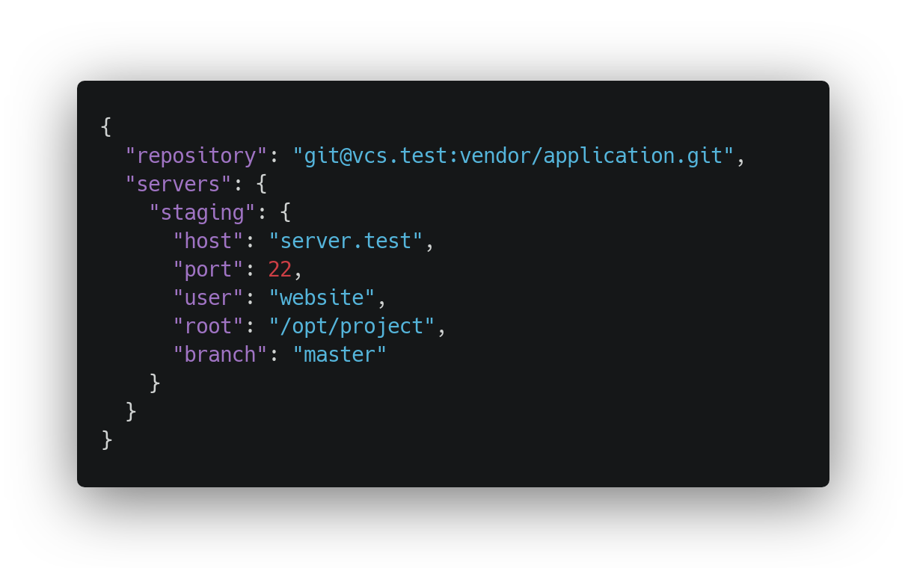

## Yet another deployment tool?

Attaché was designed around a deployment method I've been following for years now. As someone who uses Laravel a great deal, Laravel Envoy made a lot of sense and I developed a zero downtime approach to deployments that I've used many times with many different projects.

Attaché is an encapsulation of that deployment process. I wrote an article (and then rewrote that article) around it, which you can find here:

[Zero Downtime Laravel Deployments with Envoy](https://medium.com/@warrickbayman/zero-downtime-laravel-deployments-with-envoy-version-2-227c8259e31c)

Attaché does most of the actual deployment work for you. A simple JSON configuration file makes it easy to get up and running quickly. No need for long complicated deployment scripts.

I think Attaché has a fairly wide set of use cases, but it can't do everything. If you need more control over your deployment, or have something special or specific, then Attaché probably isn't for you. In that case, the recommendation is definitely [Laravel Envoy](https://laravel.com/docs/envoy).
